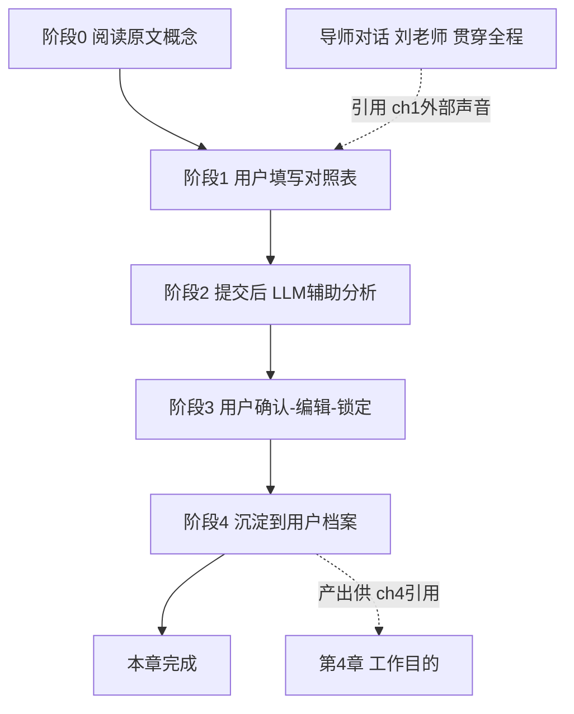

# 第二章 落地级步骤设计（依据原文 + 现有设计重做）

> 设计侧重做说明：此前从"配置字段"反推设计，开发侧看不清"每一步做什么"。本文件从用户旅程正向设计，逐阶段标清：谁输入、输入什么、输出什么、记录什么、约束、LLM 角色、依赖什么。
> 配套原文：原书第二章 MD（`chapter_md/第二章-...md`）、`PRD-ch2.md`、`chapter_config_ch02.json`、全书总览 §字段来源表。

## 0. 本章在全书旅程里的位置（依据原文）
原书第二章（标题：我们为什么会因为找不到想做的事而迷茫）是**纯说理/认知章，原文没有让用户填表的练习**。它讲三件事：
- 作者亲身故事：用外部标准（赚钱）做选择 → 赚到钱却不幸福 → 转用内部标准（自我认知）找到方向。
- 三个实证：果酱实验（选项多→瘫痪）、市值前50变迁（外部优势30年崩塌）、图2-3 外部过滤器 vs 图2-4 内部过滤器。
- 核心论点：迷茫根因 = 用"外部标准"（应该怎么做）而非"内部标准"（想怎么做）。图2-4 的内部三层过滤器（喜欢/擅长/重要）正是后续第3章"三要素公式"的雏形。

结论：ch2 的本质是**给用户建立"内外标准"的判断框架**，不是采集某项具体数据。当前 PRD 的"内外标准对照"练习，是把图2-3/2-4 产品化成的互动练习（设计侧延伸，非原书原生）。

## 1. 一句话目标
让用户把自己当前的主要事项过一遍"内外部过滤器"，**意识到自己有多少选择是被外部标准推着走的**，并标出"最该收回主动权的一件事"——为第4章"定工作目的"时不被外部标准带偏做铺垫。

## 2. "一步还是多步"先说清（最关键）
- 设计契约层（给开发侧的章节结构）：ch2 = 1 个练习单元（config 里 1 个 exercise），对应 1 个 step 容器。对开发侧说"ch2 是 1 步"没错。
- 用户交互层（落地实现）：这 1 个 step 内部有 4 个阶段（填写 → AI 辅助分析 → 用户确认锁定 → 沉淀归档），由 1 个 step runner 页面串起来，**不是 4 个独立 step**。
- 所以"1 步"指练习单元数量；"4 阶段"指这个单元里的交互流程。开发侧之前迷茫，是因为只听到"1 步"却没看到内部 4 阶段分别做什么。

## 3. 步骤流程图

## 4. 逐阶段明细
### 阶段0 阅读原文概念
- 谁：用户
- 输入：阅读原书 ch2 正文（内外标准定义、三个实证、图2-3/2-4）
- 输出：无（认知输入）
- 记录：无
- 约束：正文从 chapter_md 单文件渲染
- LLM 角色：无

### 阶段1 用户填写对照表
- 谁：用户
- 输入：用户自己列出"当前主要投入的事"（含工作、学习、关系、消费等，不限于工作），逐件标【外部驱动 / 内部驱动】，可写备注；输入区预置示例占位（见 §10.4，由设计侧提供，用户可删改）
- 输出：drive_items 列表（每项：事项文本 + 驱动类型 + 备注）
- 记录：暂存为草稿（未提交）
- 约束：1–10 条；驱动类型二选一（外部/内部）
- LLM 角色：无（纯用户填写）
- 依赖：**无上游依赖**。用户凭自己认知填，不读任何前章产出（回应"ch2 阶段没有输出可供参考"——正确，本阶段不读上游）

### 阶段2 提交 → LLM 辅助分析
- 谁：LLM（角色=心理咨询师 psychologist，辅助模式 assist）
- 输入：用户填的 drive_items + 备注
- 输出：
  - commentary：整体映照，点出"标内部但实际可能是外部"的矛盾盲点（如"学东西常指向外部认可"）
  - internal_external_ratio：汇总占比（外部% / 内部%）
  - reclaim_item（草稿）：最该收回主动权的一件事
- 记录：LLM 输出暂存，等用户确认
- 约束：LLM **不替用户定性**，只辅助发现矛盾；不重写用户输入
- LLM 角色：心理咨询师，做"盲点镜子"，不是裁判

### 阶段3 用户确认 / 编辑 / 锁定
- 谁：用户
- 输入：看 LLM 给出的 commentary + reclaim_item 草稿，可编辑 reclaim_item 文字，然后锁定
- 输出：最终 reclaim_item
- 记录：reclaim_item 写入用户档案，**lockable=true**（用户可锁，锁后 LLM 不再改）
- 约束：reclaim_item 必须用户确认后才落定；internal_external_ratio 是汇总数字，只读不锁
- LLM 角色：无

> **阶段2→3 示例（小王）**：阶段1 小王填了三件——①在四大做审计（外部驱动，备注"爸妈说稳定体面"）；②周末学油画（内部驱动，备注"自己喜欢"）；③考 CPA（外部驱动，备注"同事都在考"）。阶段2 AI 的 commentary 指出"你 3 件里 2 件外部驱动，尤其'在四大做审计'备注写'每年报税季都想辞职'，说明它长期消耗你却一直用'稳定体面'压着自己"，并给出 reclaim_item 草稿："重新评估要不要继续在四大做审计——这是我当前最该收回主动权的一件事"。阶段3 小王把草稿改成"不再用'稳定体面'说服自己留在这行，先想清楚我到底要不要做审计"后锁定。

### 阶段4 沉淀到用户档案
- 谁：系统
- 输入：阶段3 确认的 reclaim_item + 阶段2 算的 internal_external_ratio
- 输出：写入 learner_profile 两个键
- 记录：internal_external_ratio（汇总占比）、reclaim_item（收回主动权事项）
- 约束：仅写最终提交态，不写草稿
- LLM 角色：无
- 向后依赖：这两个键被**第4章 刘老师**引用（定工作目的时提醒"别用外部标准"）。这是 ch2 向后的产出，不是 ch2 内部依赖

### 贯穿：导师对话（刘老师）
- 谁：用户 + 刘老师（mentor）
- 输入：用户自由提问；刘老师上下文 = 本章 reclaim_item + **ch1 的 external_voices**（misconceptions_cleared）
- 输出：苏格拉底式追问，把"外部声音→内外标准矛盾"讲透
- 记录：对话不落 profile 键（属对话流）
- 约束：刘老师引用 ch1 外部声音建立连续性；不替用户定性
- LLM 角色：导师（刘老师），贯穿，不限阶段

## 5. 依赖总览（准确标出"第几步需要什么依赖"）
- 阶段1 填写：**无依赖**（不读上游）
- 贯穿导师对话：依赖 **ch1 external_voices（misconceptions_cleared）** —— 跨章导师上下文，非练习输入
- 阶段4 产出：→ 供 **ch4 刘老师**引用（reclaim_item / internal_external_ratio）—— 向后产出依赖

## 6. 锁定类型说明（你问的"在哪告知"——本次补上）
此前无统一文档逐字段说锁类型，本次起每章重做都补：
- reclaim_item：**lockable=true** —— 理由：用户自己确认"最该收回主动权的事"，应允许锁死不被 AI 覆盖
- internal_external_ratio：**只读**（LLM 算出的汇总），不锁不编辑
- （后续每章重做补本表，最终汇总成"全章字段锁定总表"给开发侧）

## 7. 回应你关于 ch2 的三个质疑
1. "ch2 阶段没有输出可供参考" —— 对。阶段1 填写不读任何上游，用户凭认知填。原设计 ch1 external_voices 只给刘老师对话用，不是练习输入。
2. "练习没和工作关联" —— 本质如此且应当如此。原书 ch2 用"工作"举例教判断标准，练习目的是**认知转变**（看见被外部标准推着走），不是采集工作数据。建议引导文案从"当前主要投入的事"出发，含工作但不限。
3. "ch2 对 ch5 没太多参考意义" —— 直觉对。依据总览，ch2 产出被 **ch4 刘老师**引用，不是 ch5。ch5=擅长 来自 ch3/ch5 自身。ch2 是全书"内外标准"认知基石 + ch4 铺垫，不直接喂 ch5。

## 8. 待你确认的开放点
- 占比滑块：PRD 提了"外部%/内部% 占比"，但当前 config 的 drive_items 只有 drive 类型、无占比字段。是否保留占比？（影响阶段1 输入结构）
- 练习"事项"引导文案：是否明确为"当前主要投入的事（工作/学习/关系/消费…）"？
- reclaim_item 锁定后，ch4 刘老师引用时是否显示"用户已锁定"？

## 9. 数据表与字段设计（复用分析，结论：不新增任何表/列）

> 已对照实backend 代码核对（db.py / config_loader.py / compaction.py / step_runner.py / seed_ch4.py）。**ch2 不需要新建表、不需要新增列，全部复用现有结构。** 开发侧最关心的"要不要动框架"——答案是基本不动。

### 9.1 复用的两张现有表
- **`learner_profiles`**（`user_id` PK, `profile_json` TEXT, `updated_at`）：跨章档案。ch2 的两个持久产出（`internal_external_ratio`、`reclaim_item`）作为新键落进 `profile_json` 这个 JSON blob，不占新列。
- **`step_runs`**（`id` PK, `user_answers`, `parsed_output`, `status` …）：阶段1 的 `drive_items` 存 `user_answers`；阶段2 的 `commentary` / `internal_external_ratio` / `reclaim_item` 草稿 存 `parsed_output`。现有列已够，无需改表。

### 9.2 profile_json 里新增的键（已在白名单，零改动）
`compaction.py` 的 `PROFILE_FIELDS`（第11–28行）**已包含 `internal_external_ratio` 与 `reclaim_item`**（第14–15行）。即 ch2 的 step 提交后，`compact_profile` 会自动把这两个字段并入 `learner_profiles`，**无需改白名单、无需改 compaction 逻辑**。说明开发侧之前已经为 ch2 预留了这两个键。
- `internal_external_ratio`：`{external_pct, internal_pct}`，只读（LLM 算出的汇总占比），不锁。
- `reclaim_item`：`editable_list` 类型（ch2 实际只放 1 项，即用户改定后的那句话），用户确认后写入。注意：当前**真实运行时没有字段级锁合并**，reclaim_item 的"锁定"不是靠列表里的 `locked` 子字段，而是**整步提交态**（见 9.4）。

### 9.3 ch2 练习配置（需新建，属正常分章配置，非框架改动）
`chapter_config_ch02.json` 的 `output_fields`：
- `drive_items`：用户阶段1 输入，存 `step_runs.user_answers`，不进 profile。
- `commentary`：LLM 阶段2 输出，章节内，留 `step_runs`（不落 profile）。
- `internal_external_ratio`：`output_fields` 标 `type: table, readonly: true`（schema 已支持；`readonly` 为声明意图，真实运行时不强制，锁定靠整步提交态，见 9.4）。
- `reclaim_item`：`output_fields` 标 `type: editable_list, lockable: true`（schema 已支持；`lockable` 为声明意图，真实锁定靠整步提交态）。

### 9.4 锁定机制（已按真实运行时复核修正 —— 原"复用 _merge_with_locked"结论作废）
> ⚠️ 复核发现：上一版把"锁定"锚定在 `step_runner._merge_with_locked`（legacy jinja2 路径）。实际 active 运行时是 `app/runtime/agent.py` 的 `agent.run_step`（M3 Option B，legacy jinja2 已在 M3.3 移除）；`step_runner.py` 仅用于老 config 向后兼容解析，**active 执行路径不调用 `_merge_with_locked`，也不消费 `lockable`/`readonly`**。本节按真实代码重写。

**真实的"锁定"= 整步提交态**（已核实 `routers/steps.py`）：
- 用户编辑草稿：`edit_output`（steps.py:279–297）在 `status=="submitted"` 时直接返回 409「submitted step output is locked」；只有 `saved` 态可改。
- 用户"锁定"：`submit_step`（steps.py:339）把 `status` 置为 `submitted`，并触发 compaction 归档。
- 重跑保护：`_get_or_create_run_id`（steps.py:146–160）在最新 run 已 `submitted` 时会**新建 run id**（不覆盖已提交行）。即用户"重新做本章"会开一条新草稿，已锁定的 reclaim_item 记录被保留——无需额外防覆盖代码。

**结论**：ch2 的 reclaim_item"锁定"= 用户编辑草稿（status=saved）后点"提交/确认并保存"，整步进入 submitted 即锁。该机制**已存在于 steps.py，零代码改动即可用**——只是理由不是"复用字段级合并"，而是"整步提交态守卫"。
- `output_fields` 里仍可声明 `reclaim_item: {type: editable_list, lockable: true}`、`internal_external_ratio: {type: table, readonly: true}`，作为 schema 层意图声明（前端据此渲染"可锁定/只读"UI），但**运行时强制靠提交态**。
- 用户视角不变：看 AI 的 commentary + reclaim_item 草稿 → 编辑那句话 → 点"确认并保存"→ 锁定。

### 9.5 结论（已按真实运行时复核）
ch2 数据落地方案**仍为零代码改动、不新建表/列、无 DB 迁移**，但锁定机制描述已修正：
- 两个持久产出借 `learner_profiles.profile_json` 落库，`compaction.py` 白名单**已预留** `internal_external_ratio` / `reclaim_item`，提交即自动归档（此点不变）；
- 唯一新增内容是常规分章配置 `chapter_config_ch02.json`；
- **reclaim_item 的"锁定"靠整步提交态**（`edit_output` 409 守卫 + `submit_step`），非字段级 `_merge_with_locked`；`lockable`/`readonly` 仅作 schema 意图声明；
- reclaim_item 类型 = `editable_list`（ch2 只放 1 项），internal_external_ratio 类型 = `table`，与 handoff §7.2（table→ch2 ratio）一致。

---

## 10. 专家评审结论与行动项（2026-08-06）
拉「系统架构师」+「产品管理专家」双评审，并对架构师提出的代码级质疑亲自读 `steps.py` / `compaction.py` / `agent.py` 复核。结论如下。

### 10.1 架构师评审（已逐项代码核实）
- **已推翻（我方文档原错）**：§9.4 原称"复用 `_merge_with_locked` 零代码改动"——该函数在 legacy `step_runner.py`，active 路径（`agent.run_step` / `steps.py`）不调用，也不消费 `lockable`/`readonly`。已按真实提交态锁定改写（见 §9.4）。
- **已核实成立**：不新增表/列（db.py 确认）；`PROFILE_FIELDS` 白名单已含两键（compaction.py:14–15）；`output_fields` 需补 `type`（reclaim_item→editable_list、ratio→table，handoff §7.2 支持）。
- **架构师一处过度告警（已澄清）**：原称"rerun 覆盖已提交 reclaim_item"。核实 `_get_or_create_run_id`（steps.py:146–160）在 latest=submitted 时新建 run id，**不覆盖**，已提交记录保留。

### 10.2 产品专家评审（已逐条回应）
1. 锁定术语：改为"确认并保存"；提供"重新做本章"出口（= 新建草稿 run，steps.py 已天然支持）。✅ 已采纳
2. 占比输入：**已拍板 = 系统派生**（见 10.3）。原 handoff「用户自标占比」与「用户二选一标外部/内部」冗余，已统一为系统统计、砍滑块。✅ 已采纳，且顺带解决第 6 点移动端滑块难操作。
3. 空态/引导：**已采纳**——阶段1 给 2–3 个示例事项占位（见 10.4 设计侧回应）。
4. 错误态/兜底：**已采纳**——空表/仅 1 条校验 + AI 偏差「换一种说法」（见 10.4）。
5. ch4 引用回响：**已采纳**——ch4 刘老师引用 reclaim_item 时显示回响语（见 10.4 文案）。
6. 移动端：占比滑块已随"系统派生"方案删除，无滑块难操作问题。✅ 已解决

### 10.3 两项设计冲突的拍板结果（2026-08-06）
- **占比来源 → 系统派生（已拍板）**：用户在阶段1 已把每件事项标「外部/内部驱动」（二选一），后端直接统计 外部件数÷总件数 = 外部占比%，作为 `internal_external_ratio` 写入 profile。不新增滑块、不额外调 LLM（LLM 仅在 commentary 里引用该数字，不负责"算"）。原 handoff §7.2 的"用户自标占比"与此冲突，已按产品专家建议统一为系统派生，消除冗余与移动端负担。
- **ch2 引用 ch1 external_voices → 引用，但注入浓缩摘要（已拍板）**：为延续性，ch2 阶段1 引用 ch1 的外部声音；但完整 `external_voices`（按误区编号的对象，含每条全文）经 `_select_profile_fields`（assembler.py:62）整值注入会致上下文过长、焦点丢失。处理方式见 10.4。

### 10.4 设计侧回应与落地要点
- **占比 = 系统派生**：`internal_external_ratio` = `{external_pct, internal_pct}`，由后端在提交时按用户标签统计，type=table。
- **阶段1 示例占位（占位文案由设计侧提供，开发侧仅渲染为可删改的灰色 ghost 文字，不在前端写死业务文案）**：在 drive_items 输入区**预置 3 条事项占位**，覆盖"工作 / 学习成长 / 关系消费"三类，仅为提示锚点、**不预设驱动标签**（标签由用户自己标），用户可整条删或改：
  1. 工作类：「在XX公司做审计」——备注占位「爸妈说稳定体面」
  2. 学习成长类：「周末学油画」——备注占位「自己真的喜欢」
  3. 关系/消费类：「准备考CPA」——备注占位「同事都在考，怕落后」
  - 另在输入区下方放一行灰色**标注示范**（演示"怎么标"，不预填答案）：「参考：有人写"在XX公司做审计"并标【外部驱动】，备注"爸妈说稳定体面"」
- **空表/单条兜底**：提交校验——事项数 < 2 时拦截并提示"至少列 2 件事才能对照"；LLM commentary 明显偏差时，提供「换一种说法」按钮触发重跑（新建草稿 run，不影响已提交记录）。
- **ch4 回响语（文案建议）**：ch4 刘老师引用 reclaim_item 时前置——"你之前最想收回主动权的是：『{reclaim_item}』。现在定工作目的，这件事还困着你吗？"——制造前后章回响。
- **external_voices 防上下文膨胀的具体机制**：
  - 在 profile 新增浓缩键 `external_voices_summary`（ch1 产出或由 compaction 派生，单句主题串，如「稳定体面(父母)、同事都考CPA、买房压力(社会)」），**不**把完整 `external_voices` 对象灌入 ch2。
  - ch2 的 `mentor_hooks.references` = `[misconceptions_cleared, external_voices_summary]`（引用摘要，非全文）。
  - **仅限阶段1 注入**：external_voices 摘要只在用户"贴外部/内部标签"的步骤出现，阶段2（AI 分析）/阶段3（锁定）不注入，缩小上下文面。
  - 现有 `_select_profile_fields`（assembler.py:62）按 references 整值注入、无压缩，故必须走"摘要键"而非原文键；这是本方案唯一的小跨章新增（ch1 多产一个 summary 键，非框架改动）。
