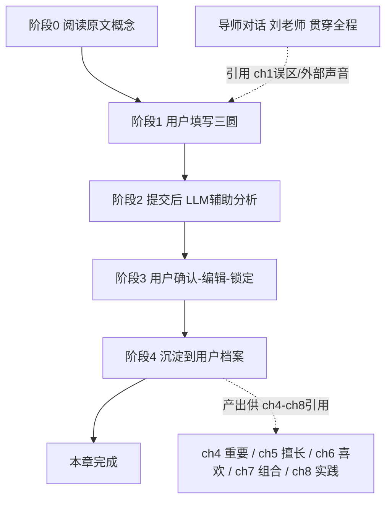

# 第三章 落地级步骤设计（依据原文 + 现有设计重做）

> 📌 **开发侧阅读入口（必读）**：本文是「ch03 三圆交集练习」的权威设计契约，讲清**每一步用户做什么、产出什么、约束与 LLM 角色、跨章依赖**。
> **配套强制阅读（与本文件互补、不可偏废）**：
> - `config/chapters/chapter_config_ch03.json` —— 字段契约与运行时参数（exercise / output_fields 的类型与 `lockable`·`readonly` / mentor_hooks / references），**是唯一被运行时消费的可执行契约**。
> - `docs/PRD/PRD-ch3.md` §3.1 —— 本章 LLM 角色（心理咨询师）的系统提示原文。
> ⚠️ **冲突裁决**：若本文（尤其 §9 对 config 的描述）与实际 `chapter_config_ch03.json` 不一致，**以 config JSON 为准**——本文 §9 为解释性说明，可能因后续微调而滞后。

> 设计侧重做说明：与 ch02 一致，从用户旅程正向设计，逐阶段标清：谁输入、输入什么、输出什么、记录什么、约束、LLM 角色、依赖什么。
> 配套原文：原书第三章 MD（`chapter_md/第三章-能最快找到想做的事的公式：自我认知法.md`）、`PRD-ch3.md`、`chapter_config_ch03.json`、全书总览 §字段来源表。
> 与本文件同构的参考：`ch02_落地级步骤设计.md`（已落地，ch03 在结构上与之对齐，仅在"数据主角"与"前端增量"上有差异，详见 §9.6）。

## 0. 本章在全书旅程里的位置（依据原文）
原书第三章（标题：能最快找到想做的事的公式：自我认知法）是全书从「解构」转向「建设」的**转折点**。它给出全书最核心的两个公式与三要素框架：
- **公式 1**：喜欢 × 擅长 = 想做的事（What × How）
- **公式 2**：喜欢 × 擅长 × 重要 = 真正想做的事（What × How × Why）
- **三要素严格定义（易混淆，需重点设计交互）**：
  - 喜欢的事 = 能持续投入热情的**领域/方向**（如心理学、设计），不是一份具体工作，更不是「想成为的人」（职业名）。
  - 擅长的事 = 天生**才能（talent）**：自然而然做得好、不痛苦、舒畅；**≠ 技能和知识（skill）**（编程/英语是后天学的、会过时）。
  - 重要的事 = **价值观（Being 状态）**：想怎样生活（自由/安心/热情）；向内=人生目的，向外=工作目的。
- **三条寻找顺序规则（纠正常见错误）**：规则 1「喜欢只是手段，先找重要的事」；规则 2「先找擅长的事（建立自信）再找喜欢的事」；规则 3「实现手段（博客/YouTube/创业/跳槽）最后再考虑」。

结论：ch3 的本质是**给用户建立「喜欢×擅长×重要」三要素框架，并把初版三要素清单沉淀为跨章种子**，是 ch4–ch8 全部练习的「输入源」。当前 PRD 的「三圆交集练习」是把图 3-2 / 3-6 / 3-12 产品化成的互动练习（设计侧延伸，非原书原生填空，但呼应原书「接下来我会一步一步地告诉你如何应用到实际生活中」的承诺）。

ch3 在流水线中的位置（与 ch2 对照）：
```
ch1 误区 → ch2 内外标准 → ch3 三要素公式（框架/种子）→ ch4 重要(价值观) → ch5 擅长 → ch6 喜欢 → ch7 组合 → ch8 实践
```
- ch2 的产出（reclaim_item / internal_external_ratio）**只被 ch4 引用**；
- ch3 的产出（likes / talents / importance / intersection）**被 ch4–ch8 全部回指**——ch3 是全书的「主干种子章」，这也是全书总览把 ch3 标为「最重要的一组跨章字段」的原因。

## 1. 一句话目标
让用户把脑中零散的「喜欢 / 擅长 / 重要」线索分别列进三个圆，借 LLM 辅助纠正两类混淆（技能当才能、职业名当喜欢）、引导拆解出真正的三要素，并标出三者重叠的「真正想做的事」初版——为 ch4–ch8 逐章深化三要素、最终组合成完整个体公式做种子。

## 2. 「一步还是多步」先说清（最关键，与 ch02 同构）
- 设计契约层（给开发侧的章节结构）：ch3 = 1 个练习单元（config 里 1 个 exercise「三圆交集练习」），对应 1 个 step 容器。对开发侧说「ch3 是 1 步」没错。
- 用户交互层（落地实现）：这 1 个 step 内部有 4 个阶段（填写三圆 → AI 辅助分析 → 用户确认/编辑/锁定 → 沉淀归档），由 1 个 step runner 页面串起来，**不是 4 个独立 step**。
- 所以「1 步」指练习单元数量；「4 阶段」指这个单元里的交互流程。开发侧此前在 ch2 的迷茫同样适用于 ch3：只听到「1 步」却没看到内部 4 阶段分别做什么。

## 3. 步骤流程图


## 4. 逐阶段明细
### 阶段0 阅读原文概念
- 谁：用户
- 输入：阅读原书 ch3 正文（两大公式、三要素严格定义、易混淆点、三条规则）
- 输出：无（认知输入）
- 记录：无
- 约束：正文从 chapter_md 单文件渲染
- LLM 角色：无

### 阶段1 用户填写三圆
- 谁：用户
- 输入：用户在三个输入区分别列出「喜欢的事」「擅长的事」「重要的事」各 3–5 项（每项一行，可增删）。**推荐填写顺序遵循原书规则：先重要 → 再擅长 → 最后喜欢**（UI 三栏按此序排，并附一句引导，见 §10.4，以纠正「一上来就陷在喜欢里」的第一个误区）。输入区预置示例占位（见 §10.4，由设计侧提供，用户可删改）。
- 输出：likes / talents / importance 三组原始清单（存 `user_answers`）
- 记录：暂存为草稿（未提交）
- 约束：每组 3–5 项；min_items = 3（少于 3 项拦截，理由同 ch02：太少无法取交集）；每项纯文本（不需要 drive 之类子字段）。
- LLM 角色：无（纯用户填写；**实时维恩图由前端本地计算重叠，不调 LLM**）。
- 依赖：**无上游依赖**。用户凭自己认知填，不读任何前章产出（回应「ch3 是否要读 ch2」——练习本身不需要；仅刘老师对话引用前章，见 §5）。
- ⚠️ **实时维恩图**：阶段1 即显示三圆，根据用户已填项实时更新重叠区。这是 ch3 相对 ch2 唯一新增的前端组件（见 §9.6 / §8 开放点2）。

### 阶段2 提交 → LLM 辅助分析
- 谁：LLM（角色 = 心理咨询师 psychologist，辅助模式 assist）
- 输入：用户三组原始清单
- 输出：
  - **commentary**：整体映照，**重点纠正两类混淆**——① 用户把「技能/知识」当「擅长」（如「会编程」→ 追问天生不痛苦就能做久的才能是什么）；② 用户把「职业名/想成为的人/实现手段」当「喜欢」（如「YouTuber」→ 追问底层喜欢的领域）。并引导拆解（「喜欢打游戏」→ 喜欢的是策略/协作/成就感？）。**不替用户定性**，只辅助发现混淆。
  - **likes / talents / importance（归一化后）**：LLM 把口语化/混淆项重分类、归并后的三要素清单——但用户可后续覆盖（PRD §8 待确认1 已建议「允许手动覆盖，LLM 仅给建议」）。
  - **intersection（草稿）**：基于三者交集的一句话总结（如「在对话里帮人理清自己」）。
- 记录：LLM 输出暂存，等用户确认
- 约束：LLM 不重写用户输入的「事实」，只做归一化建议；intersection 是初步总结，非最终。
- LLM 角色：心理咨询师，做「混淆镜子 + 拆解引导 + 取交集」，不是裁判。

### 阶段3 用户确认 / 编辑 / 锁定
- 谁：用户
- 输入：看 LLM 给出的 commentary + 归一化三清单 + intersection 草稿；可**编辑三清单文字**（覆盖 LLM 归一化）；intersection 只读不可编辑（由系统/LLM 给，用户不手改）。
- 输出：最终 likes / talents / importance（用户确认版）
- 记录：三清单写入用户档案，**lockable=true**（用户可锁，锁后 LLM 不再改）
- 约束：三清单必须用户确认后才落定；intersection 是只读总结，不锁不编辑。
- LLM 角色：无

> **阶段2→3 示例（小A）**：阶段1 小A 填——喜欢：["打游戏","看电影"]；擅长：["写代码","英语好"]；重要：["家人健康","帮助别人"]。阶段2 AI commentary：「『写代码』『英语好』是技能和知识，不是天生才能——你天生不痛苦就能做很久、别人常夸你的是什么？『打游戏』你喜欢的是策略还是和朋友协作？把擅长换成才能、喜欢拆成领域再看交集。比如『帮别人 + 表达/协作 + 一点代码』会不会是『做帮人提效的小工具』？」归一化后 talents 改为 ["把复杂讲清楚","逻辑拆解"]，likes 改为 ["游戏设计/策略","心理学"]，intersection 草稿：「用清晰的逻辑帮人把复杂的事理顺」。阶段3 小A 把 talents 里「逻辑拆解」改成「化繁为简」后锁定。

### 阶段4 沉淀到用户档案
- 谁：系统
- 输入：阶段3 确认的三清单 + 阶段2 算的 intersection
- 输出：写入 learner_profile 四个键
- 记录：likes / talents / importance / intersection
- 约束：仅写最终提交态，不写草稿
- LLM 角色：无
- 向后依赖：这四个键被 **ch4 刘老师（重要/价值观）、ch5（擅长）、ch6（喜欢）、ch7（组合）、ch8（实践）** 引用——ch3 是它们的「种子」。注意：ch4/ch5/ch6 会**重新深化**对应要素（不是编辑 ch3 的清单），ch7 直接读 ch3 的 intersection 起手（PRD §8 待确认2）。这是 ch3 向后的产出，不是 ch3 内部依赖。

### 贯穿：导师对话（刘老师）
- 谁：用户 + 刘老师（mentor）
- 输入：用户自由提问；刘老师上下文 = 本章三圆结果 + **ch1 的 misconceptions_cleared / external_voices**（延续 ch2 已建立的连续性）。
- 输出：苏格拉底式追问，把「三要素混淆」讲透，并连接前章锚点（如「你 ch1 说常被『应该做』推着走，现在写的『重要的事』里有没有其实还是外部标准？」）
- 记录：对话不落 profile 键（属对话流）
- 约束：刘老师引用前章锚点建立连续性；不替用户定性。
- LLM 角色：导师（刘老师），贯穿，不限阶段。

## 5. 依赖总览（准确标出「第几步需要什么依赖」）
- 阶段1 填写：**无依赖**（不读上游，用户凭认知填，与 ch2 阶段1 同）
- 贯穿导师对话：依赖 **ch1 misconceptions_cleared + external_voices** —— 跨章导师上下文（external_voices 由 ch2 设计已确认复用：短编号映射、白名单已含、assembler 整段注入成本可控）。⚠️ 当前 ch3 config `mentor_hooks.references` 仅 `["misconceptions_cleared"]`，未含 `external_voices`；为与 ch2 已建立的「ch1→ch2→本章」连续性一致，建议扩为 `["misconceptions_cleared","external_voices"]`（见 §8 开放点3）。
- 阶段4 产出：→ 供 **ch4–ch8** 引用（likes / talents / importance / intersection）—— 向后产出依赖（种子）。

## 6. ch03 各产出字段的锁定类型（lockable / readonly 契约）

> 本节说明 ch03 **本章内部**每个产出字段在"提交前"是「用户可锁定」还是「只读」，是给开发侧看的字段级声明。⚠️ 注意：这里说的"锁定"只管本章内，管不了提交后其他章节的改写——后者见本节点末尾表格与 §7.4 / 评审 §10.1。

- **likes / talents / importance**：`lockable=true` —— 含义：用户在 ch03 本章内编辑草稿时点「锁定」，LLM 在**本章剩余流程**里不能再改这份草稿（与 ch2 reclaim_item 同逻辑）。
- **intersection**：`readonly=true`（LLM 算出的"真正想做的事"总结），用户不可改。
- **commentary**：`readonly=true`（LLM 映照/纠正），用户不可改。
- （后续每章重做补本表，最终汇总成「全章字段锁定总表」给开发侧）

### 跨章改写硬约束（必须和上表分开理解）
`lockable` 只挡**本章内** LLM 改写，**挡不住后续独立章节**向同名 profile 键写入。已核实 `compaction.py` 的 `compact_profile([existing_profile, *outputs])` 把当前章节输出放最后、同名键以当前章为准，且 `lockable` 在 compaction 路径里根本不被读取。ch03 提交后各字段的"后续命运"：

| 字段 | ch03 内可锁定？ | 后续是否被改写 | 改写方（章节） | 能否保值到 ch07 |
|---|---|---|---|---|
| likes | 可 | **会被覆盖** | ch06（喜欢专章）写入新值 | 否（ch07 看到的是 ch06 深化版） |
| talents | 可 | **会被覆盖** | ch05（擅长专章）写入新值 | 否（ch07 看到的是 ch05 深化版） |
| importance | 可 | **不会被改写** | 无后续章写 `importance`（ch04 写的是 `values`/`work_purpose`/`ranked`） | **是（ch03 真种子）** |
| intersection | 只读 | **不会被改写** | 无任何后续章写它 | **是（ch03 真种子）** |

> ⚠️ 上表「会被覆盖」指的是**合并档案视图 `profile_json` 中的同名键被顶替**；ch03 提交后留下的**原始 `step_run` 记录永远不被触碰**（两层持久化详见 §9.7）。请勿把"档案视图被顶替"误读成"ch03 原件被改写"——原件不可改写，只是"最新值"换成了深化版。

结论：ch03 真正能"种"到 ch07 的自有产出只有 **`importance` + `intersection`**；`likes`/`talents` 锁定的真实语义是「本章首稿确认」，不是永久保值——用户侧文案必须避免"锁了就永远不变"的暗示（见 §10.2-1、§10.4 开放点6）。

## 7. 回应 ch03 的设计判断（替代 ch02 的「三质疑」）
1. 「ch3 练习是否要读 ch2 产出？」—— 练习本身不需要（三要素是独立自省），正确，本阶段不读上游；仅刘老师对话引用前章（§5）。
2. 「三要素是否允许 LLM 归一化后用户手动覆盖？」—— **是**（PRD §8 待确认1）。LLM 只给建议，用户可改；落定靠整步提交态。
3. 「intersection 是否直接作为 ch7 组合输入？」—— **是**（PRD §8 待确认2）。ch7 直接读 ch3 的 intersection 起手。
4. 「ch3 三清单被 ch4–ch6 重新深化，会不会和 ch3 锁定的冲突？」—— **分两种，不能笼统说"不冲突"**（评审后修正，详见 §10 第 1 条）：
   - **`likes` / `talents`：会被覆盖，且是「有意取代」**。ch05（擅长专章）向 `talents` 写、ch06（喜欢专章）向 `likes` 写，而 compaction 的合并顺序是「旧 profile 在前、当前章输出在后」，同名键以最后写入者为准——所以 ch03 首稿的 `likes`/`talents` 会在用户做到 ch05/ch06 时被静默替换为深化版。`lockable` 只挡本章内 LLM 改写，**挡不住跨章覆盖**。这其实是设计本意：ch5/ch6 的深度梳理本就该取代 ch3 的浅层头脑风暴。
   - **`importance`：被保值**。`importance` 由 ch03 写，而 ch04（重要/价值观专章）产出的是 `values` / `work_purpose` / `ranked`，**并不写 `importance`**，所以 ch03 的 `importance` 一直留到 ch7。
   - **`intersection`：被保值**。无任何后续章写它。
   - 结论：ch03 真正能「种」到 ch7 的自有产出是 **`importance` + `intersection`**（ch07 导师确实引用 `importance` 与 `likes`/`talents`/`work_purpose`——其中 `likes`/`talents` 到 ch7 时已是 ch5/ch6 深化版，属预期）。ch03 锁定的 `likes`/`talents` 仅代表「本章首稿确认」，用户侧文案必须避免让人误以为"锁了就永远不变"。

## 8. 待确认开放点
- **开放点1（UI 顺序）**：三栏输入是否按原书推荐顺序「重要 → 擅长 → 喜欢」排并附引导？vs 自由排序？（影响阶段1 输入结构，建议按原书顺序以纠正「先想喜欢」的误区）
- **开放点2（实时维恩图）**：维恩图是 ch3 唯一新增前端组件，需确认前端实现成本与是否要做「动态重叠高亮」（见 §9.6）。
- **开放点3（导师连续性）**：ch3 刘老师 `mentor_hooks.references` 是否扩为 `["misconceptions_cleared","external_voices"]`（与 ch2 一致）；是否进一步引 ch2 `reclaim_item`？（PRD §2.4 提了 reclaim_item，但 ch2 设计已定「reclaim_item → ch4 刘老师」，ch3 引不引需拍板，避免连续性过载）
- **开放点4（混淆徽章）**：PRD §2.3 提「混淆提示徽章」（LLM 检测技能当才能/职业名当喜欢时对应项显示提醒）。当前 output_fields 无结构化 per-item 标记，徽章需 ① 新增结构化输出（破「零新增字段」）或 ② 前端解析 commentary 派生。建议**首版不做徽章**，仅 commentary 文本纠正；徽章作后续增强（见 §9.6）。
- **开放点5（commentary 类型）**：当前 config commentary = `text`，建议与 ch2 一致改为 `markdown, readonly`（更利于分点纠正展示）。属 config 微调，无数据层影响。

> 上述开放点均已由 §10 双专家评审拍板：开放点1=采纳顺序、开放点2=维恩图陈列非求交、开放点3=扩 references 但不引 reclaim_item、开放点4=徽章首版不做、开放点5=markdown,readonly；新增开放点6=likes/talents 锁定文案不得承诺"永久"。详见 §10.3 / §10.4。

## 9. 数据表与字段设计（复用分析，结论：不新增任何表/列，且 ch03 四键已在白名单 + 结构化 + 强制下游保护）

> 已对照实 backend 代码核对（compaction.py / db.py / steps.py / schema）。**ch3 不需要新建表、不需要新增列，全部复用现有结构，且四个持久产出的键早已被预留并受保护。**

### 9.1 复用的两张现有表
- **`learner_profiles`**（`user_id` PK, `profile_json` TEXT, `updated_at`）：跨章档案。ch3 的四个持久产出（likes / talents / importance / intersection）作为新键落进 `profile_json` 这个 JSON blob，不占新列。
- **`step_runs`**（`id` PK, `user_answers`, `parsed_output`, `status` …）：阶段1 的三组原始清单存 `user_answers`；阶段2 的 commentary + 归一化三清单 + intersection 草稿 存 `parsed_output`。现有列已够，无需改表。

### 9.2 profile_json 里新增的键（已在白名单，且比 ch2 更稳妥）
`compaction.py` 的 `PROFILE_FIELDS`（第 11–28 行）**已包含 `likes`(16) / `talents`(17) / `importance`(18) / `intersection`(22)**。即 ch3 的 step 提交后，`compact_profile` 会自动把这四个字段并入 `learner_profiles`，**无需改白名单、无需改 compaction 逻辑**（开发侧之前已为 ch3 预留）。
- **更强保护（仅限预算裁剪场景）**：这四个键同时出现在 `STRUCTURED_FIELDS`（33–37 行）与 `MANDATORY_DOWNSTREAM_FIELDS`（38–40 行，likes / talents / importance 在内）。含义是**预算吃紧被裁剪时**它们优先保留、不被 trim——ch2 的 reclaim_item 仅普通键，ch3 四键保护等级更高。**注意**：这个「保护」只针对 compaction 的 token 预算裁剪，**不防跨章同名键覆盖**（见 §6 硬约束 / §10 第 1 条）。
- likes / talents / importance：`editable_list` 类型（用户改定后清单），`lockable=true`。
- intersection：`text` 类型（一句话总结），`readonly=true`。

> **评审后补：四键的"保值命运"并不相同**（据 `compact_profile([existing_profile, *outputs])` 合并顺序 + ch04–ch06 实际 output_fields 核实）：
> - `importance`：**保值**。ch04（重要专章）只写 `values` / `work_purpose` / `ranked`，不碰 `importance`，故 ch03 的 `importance` 一路留到 ch7。
> - `intersection`：**保值**。无后续章写它。
> - `talents` / `likes`：**被有意取代**。ch05 写 `talents`、ch06 写 `likes`，二者是深化同要素的专章，合并时覆盖 ch03 首稿。ch03 锁 `likes`/`talents` 只代表「本章首稿确认」，非永久保值。
> 故 ch03 的"种子"身份应精确表述为：**公式框架（`likes×talents×importance` 概念）+ `importance` 初稿 + `intersection` 初版**；`likes`/`talents` 的首稿会被 ch5/ch6 自然升级。

### 9.3 ch3 练习配置（现状已接近，仅需微调；属正常分章配置，非框架改动）
`chapter_config_ch03.json` 的 `output_fields`（现状已含 commentary / likes / talents / importance / intersection，types 基本对齐 schema）：
- `likes` / `talents` / `importance`：已 `editable_list, lockable:true` ✅ 与 schema 一致。
- `intersection`：已 `text, readonly:true` ✅。
- `commentary`：**已改为 `markdown, readonly:true`**（2026-08-07 执行，与 ch2 最终约定一致，见 §8 开放点5；前端需渲染 markdown）。
- `input_schema`：三项 `list_of_items`（likes / talents / importance），min_items=3、max_items=5，item 仅 `text` 子字段 ✅ 与 schema 一致，无需改。
- `step_role_id: "psychologist"` ✅ 已设。
- `mentor_hooks.references`：**已扩为 `["misconceptions_cleared","external_voices"]`**（2026-08-07 执行，见 §8 开放点3 / §10.4）。⚠️ 实测修正：active assembler（`assembler.py`）的 `_format_mentor_profile` 本就把整份 profile_json 全量塞进导师 prompt（references 仅控制排序），故 external_voices 即便不写进 references 也早已在导师上下文里；本次扩展是"置顶优先 + 显式声明连续性"，属稳健性微调，非功能性解锁（详见 §10.4）。

### 9.4 锁定机制（与 ch2 完全一致，复用整步提交态）
**真实的「锁定」= 整步提交态**（已核实 `routers/steps.py`，同 ch2 §9.4）：
- 用户编辑草稿：`edit_output` 在 `status=="submitted"` 时返回 409「submitted step output is locked」；只有 `saved` 态可改（含用户覆盖 LLM 归一化的三清单）。
- 用户「锁定」：`submit_step` 把 `status` 置为 `submitted`，并触发 compaction 归档。
- 重跑保护：`_get_or_create_run_id` 在 latest=submitted 时新建 run id（不覆盖已提交记录）。
**结论**：ch3 三清单「锁定」= 用户编辑草稿（status=saved，含覆盖 LLM 归一化）后点「提交/确认并保存」，整步进入 submitted 即锁。机制已存在，零代码改动。`lockable` / `readonly` 仅作 schema 意图声明（前端据此渲染「可锁/只读」UI），运行时强制靠提交态。

### 9.5 结论（已按真实运行时复核）
ch3 数据落地方案**仍为零代码改动、不新建表/列、无 DB 迁移**：
- 四个持久产出借 `learner_profiles.profile_json` 落库，提交即自动归档；
- 唯一新增内容是常规分章配置微调（commentary 改 `markdown, readonly`、mentor_hooks 扩 references）；
- 锁定靠整步提交态（同 ch2）；
- 与 ch2 同构：1 个 exercise 内部 4 阶段。
- ⚠️ **修正原表述**：上版写「四键受结构化+强制下游双重保护、优于 ch2」——该保护只针对**预算裁剪**，**不防跨章覆盖**。据实应为：四键白名单预留属实、零代码改动属实；但 `likes`/`talents` 首稿会被 ch5/ch6 覆盖（有意取代），真正保值到 ch7 的是 `importance` + `intersection`（详见 §6 硬约束、§10 第 1 条）。

### 9.6 ch3 相对 ch2 的前端增量（必须单独点明）
ch2 的原型只需 patch 现有 step card 文本组件；**ch3 引入一个 ch2 没有的新前端组件：三圆维恩图展示**（用户输入时三圆实时显示各自清单项）。
- ⚠️ **"实时计算重叠"的修正**：原稿写「前端本地计算重叠区」——**技术上不成立**。`likes`/`talents`/`importance` 是自由文本短语，"交集"不是几何集合交（无法机械求 `{心理学} ∩ {把复杂讲清楚} ∩ {家人健康}`），而是**语义层面由 LLM 在阶段2 生成的总结**（即 `intersection` 字段）。所以维恩图在阶段1 只能**把三个清单分别画进三个圆**作可视化，**重叠区的语义结论必须等阶段2 LLM 给出 `intersection` 后才填入**，不能前端本地算。前端实现时勿做"自动求交"，只做三圆陈列 + LLM 结论回填。
- 此外 PRD §2.3 的「混淆提示徽章」需结构化输出或前端解析，首版建议不做（§8 开放点4）。即 ch3 的工程增量主要是**维恩图组件（陈列三圆，非算交） + 三栏输入联动**，不属于「配置即生效」，需前端专项开发（M5 里程碑内）。

### 9.7 双层持久化与 ch03 原件的不可改写性（评审后代码核实补充）
核实 `db.py` 表结构后：ch03 的提交记录**不会被 ch05/ch06 改写**，且产品侧提出的"拿副本给下游、原件不动"语义**架构已天然具备**。机制分两层：
- **层1·权威原件层 `step_runs`（不可变）**：`step_runs` 以 `id PRIMARY KEY`，每次提交新增一行、`parsed_output` 全量存本章输出。ch03 提交→1 行；ch05/ch06 提交 `talents`/`likes`→各自新行。**互不影响、永不覆盖对方**。ch03 原始的 `likes`/`talents`/`importance`/`intersection` 永久留在 ch03 自己的 step_run 行里。
- **层2·合并便利视图 `learner_profiles.profile_json`（同名键可被顶替）**：`learner_profiles` 以 `user_id PRIMARY KEY` 单 blob，每次 compaction UPSERT 整体替换；`compact_profile([existing_profile, *outputs])` 把当前章输出置后、同名键以当前章为准。故 ch05 提交后 profile_json['talents']=ch05 深化版（ch03 首稿在"合并视图"被顶掉）、ch06 提交后 profile_json['likes']=ch06 深化版；但 `importance`（ch04 不写）、`intersection`（无人写）**始终留在 profile_json**。
- **两层如何被消费**：
  - 导师 prompt（`build_mentor_prompt`→`_format_mentor_profile`）读**层2（最新合并视图）**→ 导师看到"最新认知"（ch5/6 升级后的 likes/talents + ch03 的 importance/intersection），契合"刘老师用最新认知陪你"。
  - 步骤 prompt（`build_step_prompt`→`_format_references`）读**层1（按 `from_exercise` 拉指定章原始 output）**→ 下游章若声明 `references:[{from_exercise: ch03_step, fields:[...]}]`，拉到的是 ch03 **原始**，非合并视图。
- **结论（回应产品疑虑）**：ch03 原件（层1 step_runs）**确不可改写**；"副本给 ch05/06、ch03 不动"正是当前架构——step_runs=原件，profile_json=合并副本，ch05/06 写各自新行+副本视图，**绝不触碰 ch03 的 step_run 行**。无需改架构。
- **唯一真实缺口（已决策：当前不需要）**：导师合并视图在 ch05/06 之后**无法同时显示 ch03 原版 likes/talents**（只显示最新）。若要做"你第三章最初写 X、第5章深化成 Y"的**前后对照叙事**，需在相关下游章显式声明 `exercise.references:[{from_exercise: ch03_step, fields:[likes,talents]}]`（从层1 拉原版）。**用户 2026-08-07 决策：ch03 初稿三清单只是初步列举、对后续参考意义有限，暂不补此缺口（即维持"导师用最新认知"现状，不拉 ch03 原版做对照）。已记为 TODO，待 ch05/06 设计时再判断是否需要；届时若仍需前后对照再补 `exercise.references`。**

## 10. 双专家评审（系统架构师 + 产品管理专家，仿 ch02 §10）

> 设计侧已完成代码级自检（§9 已逐项核实 `compaction.py` / `config_loader.py` / `routers/steps.py` / `assembler.py` / ch04–ch07 config）。评审在自检基础上，从**技术落地**与**用户产品**两个角度复核，发现 1 项关键架构误判（已回写 §6/§7.4/§9.2/§9.5/§9.6）与若干产品文案/UX 建议。

### 10.1 系统架构师评审结论
- **【关键·已修正】跨章同名键覆盖**：核实 `routers/steps.py` 提交路径 `compact_profile([existing_profile, *outputs])`——当前章节输出排在最后，**同名键以当前章为准**；`lockable` 在 compaction 路径完全不被读取。结合下游 config：
  - ch05 `output_fields` 含 `talents` → **覆盖 ch03 的 `talents` 首稿**；
  - ch06 `output_fields` 含 `likes` → **覆盖 ch03 的 `likes` 首稿**；
  - ch04 只写 `values`/`work_purpose`/`ranked`，**不写 `importance`** → ch03 的 `importance` 保值；
  - `intersection` 无人覆盖 → 保值。
  → 原 §7.4「不冲突」表述错误，已据实改为「分两种」。**这是设计本意的「有意取代」**（ch5/ch6 深度梳理本该升级 ch3 浅层头脑风暴），但 ch03 的 `lockable` 承诺若被用户理解为"永久锁定"会出错，须靠文案收敛（见 §10.2-1、§10.4 开放点6）。
- **【中·已修正】维恩图"本地计算重叠"不成立**：`likes/talents/importance` 是自由文本短语，"交集"是语义层 LLM 总结（`intersection` 字段），非几何集合交，前端无法本地算。已修正 §9.6：维恩图作用=**三圆陈列各自清单 + 等阶段2 LLM 回填语义结论**，勿做自动求交。
- **【低·通过】预算护栏**：`MAX_PROFILE_TOKENS=800`、mentor/step guard 各 3000；三清单(各3–5)+intersection+importance 远在预算内；扩 `external_voices`（短编号映射，白名单已含）增量可忽略，≤3k 护栏稳。
- **【低·通过】测试对齐**：`test_context_integrity.py` 已强制 ch03「三圆输入 + 引用 ch1 misconception profile」。config 改动**必须保留 `misconceptions_cleared`**（不得为加 `external_voices` 而删它），`external_voices` 为纯增量，兼容。
- **【信息】ch07 引用一致性**：ch07 `mentor_hooks.references = [work_purpose, talents, likes, importance]`——到 ch7 时 `likes/talents` 已是 ch5/ch6 深化版、`importance` 仍是 ch03 版，混合引用恰是预期"组合深化"，无冲突。

### 10.2 产品管理专家评审结论
- **【高·产品】锁定文案不可过度承诺**：原 §10.4「确认后点保存，后面几章会一直用到」对 `importance`/`intersection` 为真，但对 `likes`/`talents` 为假（ch5/ch6 会替换成更好的）。建议锁定区引导改为：「这是你的**初版**三要素——『重要的事』和『真正想做的事（初版）』会一路陪你到第七章；『喜欢/擅长』我们会在第 5、6 章带你深挖、自动升级成更准的版本。」既诚实又制造"后面还会回来"的期待感。
- **【中·通过】三栏顺序引导**：采用「重要→擅长→喜欢」并附误区提示，直接破解本书第一个误区，产品决策正确，保留。
- **【中·通过】混淆纠正 UX（首版）**：依赖阶段2 `commentary` 文本纠正 + 三栏下方"参考示范"灰字自我暗示，首版足够；PRD 的"混淆徽章"需结构化 per-item 输出，首版不做（开放点4 维持），建议 v2 再评估「输入时软提示」（需结构化检测，非配置即生效）。
- **【低·通过】intersection 只读 + "初版"标签**：既防用户写矛盾，又给 ch7 深化留预期，合理。
- **【低·通过】空态/重跑兜底**：min_items=3 提交拦截、「换一种说法」触发新草稿 run（已核实 `_get_or_create_run_id` 在 submitted 时新建 run 不覆盖），机制正确。

### 10.3 评审共识：修订项与待拍板项
| 类别 | 项 | 结论 |
|---|---|---|
| 已回写文档 | §6/§7.4/§9.2/§9.5/§9.6 错误表述 | 已据代码核实修正（跨章覆盖、维恩语义） |
| 已执行-配置 | commentary 改 `markdown, readonly` | 已执行（2026-08-07），前端需渲染 markdown |
| 已执行-配置 | mentor_hooks.references 扩 `["misconceptions_cleared","external_voices"]` | 已执行（2026-08-07）。实测修正：active assembler 的 `_format_mentor_profile` 本就全量注入 profile，故扩展仅"置顶优先+显式连续性"，非功能解锁 |
| 已拍板-产品 | 三栏顺序=重要→擅长→喜欢 | 用户确认采纳 |
| 已拍板-产品 | 是否进一步引 ch2 `reclaim_item` 进 ch3 导师 | 用户确认**不引**（ch2 已路由 reclaim_item→ch4） |
| 已拍板-产品 | likes/talents 锁定文案不得承诺"永久" | 已写入 §10.4 诚实文案（层1 step_runs 天然保住原件，无需靠锁定承诺永久） |
| 维持 | 混淆徽章首版不做（v2 评估） | 维持 |

### 10.4 设计侧回应与落地要点（开放点最终拍板 + 修正后文案）
- **阶段1 示例占位（占位文案由设计侧提供，开发侧仅渲染为可删改的灰色 ghost 文字，不在前端写死业务文案）**：在三栏输入区**各预置 1–2 条事项占位**，覆盖三类，仅为提示锚点、**不预设是喜欢/擅长/重要中的哪类范畴**（范畴由用户自己判断填进对应圆），用户可整条删或改：
  1. 喜欢类：「心理学 / 设计」——备注占位「你一做就忘记时间的事」
  2. 擅长类：「很会安慰人」——备注占位「别人常找你帮忙的事」
  3. 重要类：「家人健康」——备注占位「你真正在乎的状态」
  - 另在三栏下方放一行灰色**标注示范**（演示「怎么避免混淆」，不预填答案）：「参考：有人写"会编程"被 AI 提醒这是技能不是才能，改成了"把复杂讲清楚"；有人写"YouTuber"被提醒那是职业名，改成了"表达/表演"」。
- **三栏顺序引导小字（开放点1 拍板=采纳）**：「建议顺序：先想清楚什么对你真正重要（价值观）→ 再想你天生擅长什么（才能）→ 最后才想喜欢什么（领域）。别一上来就陷在"喜欢"里——那是本书提醒的第一个误区。」
- **空态/单组兜底**：提交校验——任一组事项数 < 3 时拦截并提示「每类至少列 3 项才能取交集」；LLM commentary 明显偏差时，提供「换一种说法」按钮触发重跑（新建草稿 run，不影响已提交记录）。
- **ch4–ch8 回响（文案建议，体现 ch3 是种子章）**：ch4 刘老师开场可引用——「你之前在第三章列的三要素里，'重要的事'写着『{importance}』。现在定工作目的，这件事还是你最在乎的吗？」（⚠️ 此处用 `importance` 安全，因 ch04 不覆盖它）；ch7 组合起手引用 intersection——「你第三章最初的交集是『{intersection}』，后来我们在第5、6章把'喜欢'和'擅长'深挖过了，现在合起来看看？」——制造前后章回响。
- **ch03 引用 ch01 外部声音（延续性，开放点3 拍板=扩 references，2026-08-07 已执行）**：直接复用现有 `external_voices`（短编号映射，白名单已含），`mentor_hooks.references` 扩为 `["misconceptions_cleared","external_voices"]`，**保留 misconceptions_cleared**（测试强约束）。⚠️ **实测修正机制描述**：`mentor_hooks.references` 走的是导师 prompt 的 `_format_mentor_profile`（按 profile 键名取合并视图 profile_json），**不是** step prompt 的 `_format_references`（那才按 `from_exercise` 拉 step_runs 原始）。而 active assembler 的 `_format_mentor_profile` 本就把整份 profile_json **全量**塞进导师 `[learner profile]` 块（references 仅控制排序），故 external_voices 即便不写进 references 也早已可见。本次扩展是"置顶优先 + 显式声明连续性"，属稳健性微调，**非功能性解锁**；导师自身 response rules 已含「先回应用户……外部声音」，无需改 prompt 即会善用。不新增字段、不碰 compaction。**不引 `reclaim_item`**（开放点3 子项拍板：ch2 已路由 reclaim_item→ch4）。
- **likes / talents / importance 的用户可见中文标签（⚠️ 禁止把字段名原样展示给用户，那是内部名）**：
  - 输入区主标签（推荐）：「喜欢的事」「擅长的事」「重要的事」——这三个词本身已是用户友好词，可直接用（比 reclaim_item 幸运）。
  - **三清单锁定区引导小字（开放点6 修正版，诚实不夸大）**：「上面是 AI 帮你理清的三要素（初版）。哪条你不同意可以直接改；确认后点"确认并保存"。其中『重要的事』和『真正想做的事（初版）』会一路陪你到第七章；『喜欢/擅长』我们会在第 5、6 章带你深挖、自动升级成更准的版本——所以这里先放手写，不用追求完美。」
  - intersection 标签（推荐）：「你真正想做的事（初版）」——扣住全书核心词，且标明"初版"以呼应 ch7 还会组合深化（维恩图重叠区在阶段1 为空，阶段2 LLM 回填此结论）。
  - commentary 标签（推荐，开放点5 拍板=markdown,readonly）：「AI 的提醒」——比"分析"更口语，契合"混淆镜子"定位；改为 markdown 利于分点纠正展示。
- **维恩图实现口径（开放点2 拍板）**：ch3 唯一新增前端组件=三圆维恩图展示；作用=**三圆分别陈列用户已填清单项 + 阶段2 后把 LLM `intersection` 结论回填到重叠区**，前端**不做几何求交**（自由文本无法机械求交）。属前端专项（M5 里程碑），非"配置即生效"。
