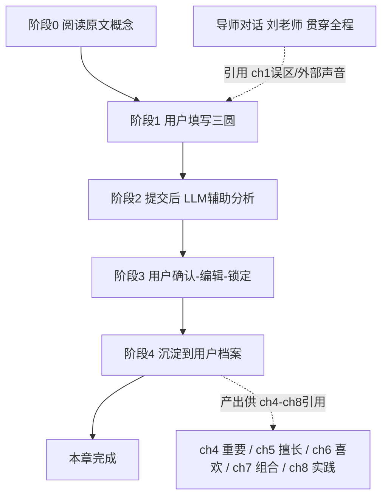

# 第三章 落地级步骤设计（ch03 三圆交集练习）

> 📌 **开发侧阅读入口（唯一交接文件）**：本文是「ch03 三圆交集练习」的权威设计契约，讲清**每一步用户做什么、产出什么、约束与 LLM 角色、跨章依赖**。开发交接**只需本文件 + 本文件路由到的文件**，不另发整包。
> **本文与权威文件的分工（各管一层，本文为意图/索引层）**：
> - **字段契约 / 运行时参数**（exercise、`output_fields` 类型与 `lockable`/`readonly`、`mentor_hooks`/`references`）→ `config/chapters/chapter_config_ch03.json`（**权威源**：运行时读的是 `chapter_configs` 表中由本 JSON 灌入的 active 行，并非直接读本文件。改完本 JSON 后必须发布到 DB（seed/save）并跑 `scripts/check_config_consistency.py` 确认无漂移，否则会出现"文档已改、运行仍跑旧配置"的漂移）
> - **本章 LLM 角色系统提示原文**（心理咨询师）→ `docs/PRD/PRD-ch3.md` §3.1
> - **视觉与交互对齐**（三栏顺序、维恩陈列、锁定文案、四阶段走查）→ `platform/prototype/ch03_exercise_mockup.html`（可点击原型）；像素级见 Ardot 设计稿 fileId `712570033499255`
> - **原书第三章正文** → `chapter_md/第三章-能最快找到想做的事的公式：自我认知法.md`
> ⚠️ **冲突裁决**：若本文（尤其 §8 对 config 的描述）与实际 `chapter_config_ch03.json` 不一致，**以 config JSON 为准**——本文为解释性说明，可能因后续微调而滞后。

## 0. 本章在全书旅程里的位置
原书第三章（能最快找到想做的事的公式：自我认知法）是全书从「解构」转向「建设」的转折点，给出核心公式与三要素框架：
- **公式 1**：喜欢 × 擅长 = 想做的事（What × How）
- **公式 2**：喜欢 × 擅长 × 重要 = 真正想做的事（What × How × Why）
- **三要素严格定义（易混淆，交互重点）**：
  - 喜欢 = 能持续投入热情的**领域/方向**（如心理学、设计），不是一份具体工作或「想成为的人」（职业名）。
  - 擅长 = 天生**才能（talent）**：自然而然做得好、不痛苦；**≠ 技能/知识（skill）**（编程/英语是后天学的、会过时）。
  - 重要 = **价值观（Being 状态）**：想怎样生活（自由/安心/热情）；向内=人生目的，向外=工作目的。
- **三条寻找顺序规则（纠正常见错误）**：① 喜欢只是手段，先找重要的事；② 先找擅长（建立自信）再找喜欢；③ 实现手段（博客/YouTube/创业）最后再考虑。

ch3 的本质：给用户建立「喜欢×擅长×重要」框架，并把初版三要素清单沉淀为**跨章种子**，是 ch4–ch8 全部练习的输入源。
```
ch1 误区 → ch2 内外标准 → ch3 三要素公式（框架/种子）→ ch4 重要(价值观) → ch5 擅长 → ch6 喜欢 → ch7 组合 → ch8 实践
```
- ch2 产出（reclaim_item / internal_external_ratio）**只被 ch4 引用**；
- ch3 产出（likes / talents / importance / intersection）**被 ch4–ch8 全部回指**——ch3 是全书「主干种子章」。

## 1. 一句话目标
让用户把零散的「喜欢 / 擅长 / 重要」线索分别列进三个圆，借 LLM 辅助纠正两类混淆（技能当才能、职业名当喜欢）、引导拆解出真正的三要素，并标出三者重叠的「真正想做的事」初版——为 ch4–ch8 逐章深化、最终组合成完整个体公式做种子。

## 2. 「一步还是多步」先说清
- 设计契约层：ch3 = 1 个练习单元（config 里 1 个 exercise「三圆交集练习」），对应 1 个 step 容器。对开发侧说「ch3 是 1 步」没错。
- 用户交互层：这 1 个 step 内部有 4 个阶段（填写三圆 → AI 辅助分析 → 用户确认/编辑/锁定 → 沉淀归档），由 1 个 step runner 页面串起来，**不是 4 个独立 step**。
- 「1 步」指练习单元数量；「4 阶段」指交互流程。

## 3. 步骤流程图


## 4. 逐阶段明细
### 阶段0 阅读原文概念
- 谁：用户。输入：阅读原书 ch3 正文。记录：无。LLM 角色：无。

### 阶段1 用户填写三圆
- 谁：用户。
- 输入：用户在三个输入区分别列出「喜欢的事」「擅长的事」「重要的事」各 3–5 项（每项一行，可增删）。**推荐填写顺序：先重要 → 再擅长 → 最后喜欢**（UI 三栏按此序排，引导小字见 §7）。输入区预置示例占位（见 §7，设计侧提供、用户可删改）。
- 输出：likes / talents / importance 三组原始清单（存 `user_answers`）。
- 记录：暂存为草稿（未提交）。
- 约束：每组 3–5 项；min_items = 3（少于 3 拦截，太少无法取交集）；每项纯文本。
- LLM 角色：无。维恩图仅前端展示三圆陈列，重叠区语义结论待阶段2 回填（不调 LLM 算几何交，见 §7 维恩口径）。
- 依赖：**无上游依赖**，用户凭认知填，不读前章产出（仅刘老师对话引用前章，见 §5）。

### 阶段2 提交 → LLM 辅助分析
- 谁：LLM（角色 = 心理咨询师 psychologist，辅助模式 assist；**角色系统提示原文见 `docs/PRD/PRD-ch3.md` §3.1**）。
- 输入：用户三组原始清单。
- 输出：
  - **commentary**：整体映照，**重点纠正两类混淆**——① 把「技能/知识」当「擅长」（「会编程」→ 追问天生不痛苦就能做久的才能）；② 把「职业名/想成为的人/实现手段」当「喜欢」（「YouTuber」→ 追问底层喜欢的领域）；并引导拆解（「喜欢打游戏」→ 喜欢的是策略/协作/成就感？）。**不替用户定性**。
  - **likes / talents / importance（归一化后）**：LLM 把口语/混淆项重分类、归并后的三要素清单——用户可后续覆盖（LLM 仅给建议）。
  - **intersection（草稿）**：基于三者交集的一句话总结（如「在对话里帮人理清自己」）。
- 记录：LLM 输出暂存，等用户确认。
- 约束：LLM 不重写用户输入的「事实」，只做归一化建议；intersection 是初步总结，非最终。

### 阶段3 用户确认 / 编辑 / 锁定
- 谁：用户。
- 输入：看 commentary + 归一化三清单 + intersection 草稿；可**编辑三清单文字**（覆盖 LLM 归一化）；intersection 只读不可编辑。
- 输出：最终 likes / talents / importance（用户确认版）。
- 记录：三清单写入用户档案，`lockable=true`（用户可锁，锁后 LLM 不再改）。
- 约束：三清单必须用户确认后才落定；intersection 只读，不锁不编辑。

> **示例（小A）**：阶段1 小A 填——喜欢：["打游戏","看电影"]；擅长：["写代码","英语好"]；重要：["家人健康","帮助别人"]。阶段2 AI commentary：「『写代码』『英语好』是技能和知识，不是天生才能——你天生不痛苦就能做很久、别人常夸你的是什么？『打游戏』你喜欢的是策略还是和朋友协作？把擅长换成才能、喜欢拆成领域再看交集。比如『帮别人 + 表达/协作 + 一点代码』会不会是『做帮人提效的小工具』？」归一化后 talents 改为 ["把复杂讲清楚","逻辑拆解"]，likes 改为 ["游戏设计/策略","心理学"]，intersection 草稿：「用清晰的逻辑帮人把复杂的事理顺」。阶段3 小A 把 talents 里「逻辑拆解」改成「化繁为简」后锁定。

### 阶段4 沉淀到用户档案
- 谁：系统。
- 输入：阶段3 确认的三清单 + 阶段2 算的 intersection。
- 输出：写入 learner_profile 四个键（likes / talents / importance / intersection）。
- 约束：仅写最终提交态，不写草稿。
- 向后依赖：这四个键被 **ch4（重要/价值观）、ch5（擅长）、ch6（喜欢）、ch7（组合）、ch8（实践）** 引用——ch3 是它们的「种子」。注意：ch4/ch5/ch6 会**重新深化**对应要素（不是编辑 ch3 的清单），ch7 组合的是 ch4–ch6 深化版（ch6 `likes` × ch5 `talents`，用 ch4 `work_purpose` 筛、以 `values` 作核心价值观），**不读 ch3、不消费 `importance`/`intersection`**（详见 §6 跨章覆盖表与 ch07 config `references=[talents,likes,work_purpose,values]`）。

### 贯穿：导师对话（刘老师）
- 谁：用户 + 刘老师（mentor）。
- 输入：用户自由提问；刘老师上下文 = 本章三圆结果 + **ch1 的 misconceptions_cleared / external_voices**（延续 ch2 连续性）。
- 输出：苏格拉底式追问，把「三要素混淆」讲透，并连接前章锚点。
- 约束：刘老师引用前章锚点建立连续性；不替用户定性。LLM 角色：导师（刘老师），贯穿，不限阶段。

## 5. 依赖总览
- 阶段1 填写：**无依赖**（不读上游，用户凭认知填）。
- 贯穿导师对话：依赖 **ch1 misconceptions_cleared + external_voices** —— 跨章导师上下文。ch3 config 的 `mentor_hooks.references` 已扩为 `["misconceptions_cleared","external_voices"]`（**保留 misconceptions_cleared**，满足测试强约束；external_voices 为纯增量）。
- 阶段4 产出：→ 供 **ch4–ch8** 引用（向后产出依赖，种子）。

## 6. 各产出字段的锁定类型（lockable / readonly 契约）
本节说明 ch03 **本章内部**每个产出字段在"提交前"是「用户可锁定」还是「只读」，是给开发侧的字段级声明。⚠️ "锁定"只管本章内，管不了提交后其他章节的改写——后者见本节点末尾表格与 §8.7。

- **likes / talents / importance**：`lockable=true` —— 用户在 ch03 本章内编辑草稿时点「锁定」，LLM 在**本章剩余流程**里不能再改这份草稿（与 ch2 reclaim_item 同逻辑）。
- **intersection**：`readonly=true`（LLM 算出的"真正想做的事"总结），用户不可改。
- **commentary**：`readonly=true`（LLM 映照/纠正），用户不可改。

### 跨章改写硬约束（必须和上表分开理解）
`lockable` 只挡**本章内** LLM 改写，**挡不住后续独立章节**向同名 profile 键写入。已核实 `compaction.py` 的 `compact_profile([existing_profile, *outputs])` 把当前章节输出放最后、同名键以当前章为准，且 `lockable` 在 compaction 路径里根本不被读取。ch03 提交后各字段的"后续命运"：

| 字段 | ch03 内可锁定？ | 后续是否被改写 | 改写方（章节） | 能否保值到 ch07 |
|---|---|---|---|---|
| likes | 可 | **会被覆盖** | ch06（喜欢专章）写入新值 | 否（ch07 看到的是 ch06 深化版） |
| talents | 可 | **会被覆盖** | ch05（擅长专章）写入新值 | 否（ch07 看到的是 ch05 深化版） |
| importance | 可 | **不会被改写** | 无后续章写 `importance`（ch04 写的是 `values`/`work_purpose`/`ranked`） | **否（ch07 不消费 `importance`；其「重要」轴由 ch04 `values`/`work_purpose` 提供，见 ch07 config `references=[talents,likes,work_purpose,values]`）** |
| intersection | 只读 | **不会被改写** | 无任何后续章写它 | **否（ch07 不消费 `intersection`；`intersection` 仅持久化于 profile，不被 ch07 读取）** |

> ⚠️ 上表「会被覆盖」指**合并档案视图 `profile_json` 中的同名键被顶替**；ch03 提交后留下的**原始 `step_run` 记录永远不被触碰**（两层持久化见 §8.7）。请勿把"档案视图被顶替"误读成"ch03 原件被改写"——原件不可改写，只是"最新值"换成了深化版。

结论：ch03 是三要素框架/种子章：**`likes`/`talents` 被 ch06/ch05 深化版取代，`importance`/`intersection` 虽持久化于 profile 但均不被 ch07 消费**；ch07 实际组合的是 ch04–ch06 深化版（ch6 `likes` × ch5 `talents`，用 ch4 `work_purpose` 筛、以 `values` 作核心价值观），**不读 ch3、不消费 `importance`/`intersection`**。`likes`/`talents` 锁定的真实语义是「本章首稿确认」，不是永久保值——用户侧文案须避免"锁了就永远不变"的暗示（见 §7 锁定区引导小字）。

## 7. 用户可见文案与前端提示
> 以下文案为设计侧提供的 UI 建议，开发侧渲染即可，不在前端写死业务逻辑；标签/引导属前端展示层。

- **三栏顺序引导小字**：「建议顺序：先想清楚什么对你真正重要（价值观）→ 再想你天生擅长什么（才能）→ 最后才想喜欢什么（领域）。别一上来就陷在"喜欢"里——那是本书提醒的第一个误区。」
- **输入区示例占位（ghost 文字，可删改，不预设范畴）**：
  - 喜欢类：「心理学 / 设计」——备注占位「你一做就忘记时间的事」
  - 擅长类：「很会安慰人」——备注占位「别人常找你帮忙的事」
  - 重要类：「家人健康」——备注占位「你真正在乎的状态」
  - 另在三栏下方放一行灰色标注示范（演示"怎么避免混淆"，不预填答案）：「参考：有人写"会编程"被 AI 提醒这是技能不是才能，改成了"把复杂讲清楚"；有人写"YouTuber"被提醒那是职业名，改成了"表达/表演"。」
- **三清单锁定区引导小字（诚实不夸大）**：「上面是 AI 帮你理清的三要素（初版）。哪条你不同意可以直接改；确认后点"确认并保存"。其中『重要的事』和『真正想做的事（初版）』会一路陪你到第七章；『喜欢/擅长』我们会在第 5、6 章带你深挖、自动升级成更准的版本——所以这里先放手写，不用追求完美。」
- **各字段用户可见标签（⚠️ 禁止把字段名原样展示给用户）**：
  - 输入区主标签：「喜欢的事」「擅长的事」「重要的事」
  - intersection：「你真正想做的事（初版）」——标明"初版"以呼应 ch7 还会组合深化（维恩图重叠区阶段1 为空，阶段2 LLM 回填此结论）
  - commentary：「AI 的提醒」——契合"混淆镜子"定位；已为 `markdown` 类型，前端需渲染 markdown
- **空态/重跑兜底**：任一组事项数 < 3 时拦截并提示「每类至少列 3 项才能取交集」；LLM commentary 明显偏差时，提供「换一种说法」按钮触发重跑（新建草稿 run，不影响已提交记录）。
- **维恩图实现口径**：ch3 唯一新增前端组件=三圆维恩图展示；作用=**三圆分别陈列用户已填清单项 + 阶段2 后把 LLM `intersection` 结论回填到重叠区**，前端**不做几何求交**（likes/talents/importance 是自由文本，无法机械求交）。属前端专项（M5 里程碑），非"配置即生效"。PRD §6.2 的「混淆提示徽章」首版不做（需结构化 per-item 输出，非配置即生效）。**视觉稿见 `platform/prototype/ch03_exercise_mockup.html`（Ardot 设计稿 fileId `712570033499255`）。**
- **想不出？引导问题（防卡壳）**：前端从 config 的 `guiding_questions`（4 条）渲染「想不出？参考这 4 个引导问题」可折叠面板，放在阶段1 三栏下方。**只给起点、不预设答案**；与三栏示例占位（演示"怎么避免混淆"）是两套不同提示，别混。
- **阶段1 外部声音回响（UI 提示层，显式建模为 `ui_context`）**：阶段1 填写时，右栏提示可回响 ch1 的 `external_voices`（如"稳定体面""同事都考 CPA"），提醒用户"它们不是你的方向，别被带跑"。该展示**仅属 UI 提示层**，由 config 的 `ui_context.references: ["external_voices"]` 显式声明，**绝不参与步骤分析 prompt**（步骤分析靠 `step_context.references=[]` 保持零前章依赖），也**不是** `mentor_hooks`（那是导师对话引用）。三路上下文（步骤分析 / 导师对话 / UI 提示）彻底解耦，建立跨章连续性而不污染练习逻辑。
- **ui_context 渲染规格（设计侧确认 · 2026-08-09，回应开发侧第二轮追加追问）**：
  - **数据接口**：采用「步骤详情接口直接返回已过滤 `ui_context`」方案（**不**新增用户级端点）。后端据 `ui_context.references`（此处 `external_voices`）从 profile 取出、映射成渲染结构后随步骤详情一并返回；**前端不得直接读 `learner_profile` 全文**。返回结构（示例）：
    ```json
    {
      "ui_context": {
        "external_voices": [
          { "misconception_id": "3", "misconception_label": "必须是对别人有益的事", "voice_text": "我爸总说选错行一辈子就完了" },
          { "misconception_id": "5", "misconception_label": "想做的事不能成为工作", "voice_text": "同事都考 CPA，我也得考" }
        ]
      }
    }
    ```
    （`misconception_label` 由 ch01 静态清单 id 1–5 映射；仅保留非空 voice；按 `misconception_id` 升序。）若后续 ui_context 被多屏复用，再评估抽成独立 `GET /api/learner-profile/ui-context`。
  - **展示格式**：每条声音**同时显示误区标签 + 原文**（如「误区 3 · 必须是对别人有益的事：我爸总说…」），不只显示裸文本；多条**按误区编号升序**（与 ch01 勾选顺序一致、可预期）。
  - **缺失数据（硬规则，无备选）**：`external_voices` 完全为空/缺失 → **整块隐藏**该回响区（导师对话 `mentor_hooks` 已承载 ch01 连续性），**不显示任何占位文案**；**部分缺失 → 只渲染已存在的声音**，不补占位、不造假、不显占位。
  - **保存与 Prompt 边界（硬约束）**：ui_context **仅用于右栏渲染**；**不写入** ch03 `user_answers`；**不进入**步骤分析 Prompt（`step_context.references=[]` 已隔离，assembler 不得把 `ui_context` 路由进 `build_step_prompt`）；**不作为** LLM 分析证据（psychologist role 分析三清单时不接收任何 `external_voices` 文本）。后端步骤详情序列化器可填充 `ui_context`，但 Prompt 汇编器必须忽略它。
- **ch4–ch8 回响文案建议（体现 ch3 是种子章）**：
  - ch4 刘老师开场可引用 importance——「你之前在第三章列的三要素里，'重要的事'写着『{importance}』。现在定工作目的，这件事还是你最在乎的吗？」（⚠️ 用 `importance` 安全，因 ch04 不覆盖它）
  - ch7 组合起手引用 intersection——「你第三章最初的交集是『{intersection}』，后来我们在第5、6章把'喜欢'和'擅长'深挖过了，现在合起来看看？」

## 8. 数据表与字段设计
> 已对照实 backend 代码核对（compaction.py / db.py / steps.py / schema）。**ch3 不新建表、不新增列，全部复用现有结构，四个持久产出的键早已预留并受保护。**

### 8.1 复用的两张现有表
- **`learner_profiles`**（`user_id` PK, `profile_json` TEXT）：跨章档案。ch3 四个持久产出作为新键落进 `profile_json` 这个 JSON blob，不占新列。
- **`step_runs`**（`id` PK, `user_answers`, `parsed_output`, `status` …）：阶段1 原始清单存 `user_answers`；阶段2 的 commentary + 归一化三清单 + intersection 草稿 存 `parsed_output`。现有列已够。

### 8.2 profile_json 里新增的键（已在白名单）
`compaction.py` 的 `PROFILE_FIELDS` **已包含 `likes` / `talents` / `importance` / `intersection`**。ch3 提交后 `compact_profile` 自动并入库，**无需改白名单、无需改 compaction 逻辑**。四键同时出现在 `STRUCTURED_FIELDS` 与 `MANDATORY_DOWNSTREAM_FIELDS`，含义是**预算裁剪时优先保留、不被 trim**（仅限预算场景，不防跨章覆盖，见 §6）。
- likes / talents / importance：`editable_list`，`lockable=true`。
- intersection：`text`，`readonly=true`。

### 8.3 ch3 练习配置（现状，已微调完毕）
`chapter_config_ch03.json` 当前状态（**开发侧无需改，仅渲染**）：
- `output_fields`：commentary（`markdown, readonly`，已改）、likes / talents / importance（`editable_list, lockable:true`）、intersection（`text, readonly`）—— 全部与 schema 一致。
- `input_schema`：三项 `list_of_items`，min_items=3、max_items=5，item 仅 `text` 子字段。
- `step_role_id: "psychologist"`。
- `mentor_hooks.references: ["misconceptions_cleared","external_voices"]`（已扩，保留 misconceptions_cleared 满足测试强约束）。
- `step_context.references: []`（**2026-08-08 开发 review 后新增**）：明确 ch03 步骤分析阶段**不读任何前章 profile**，与 §5「阶段1 无依赖」一致；步骤 prompt 的跨章注入由此字段控制，与 `mentor_hooks.references`（仅导师对话用）解耦。详见 `docs/ch03_落地级步骤设计_开发review_设计侧回复.md` §1、§5。
- `ui_context.references: ["external_voices"]`（**2026-08-09 第 2 轮开发反馈后新增**）：UI 提示层的跨章引用，仅用于阶段1 右栏"外部声音回响"展示，**不参与步骤分析、不参与导师对话**。与 `step_context`（步骤分析，空）、`mentor_hooks`（导师对话，ch1 两字段）构成三路独立上下文。若产品侧希望"阶段1 完全零前章展示"，可改为空数组 `[]` 并依赖导师对话承载连续性（见 §10 开放点）。

> ⚠️ **测试约束**：`test_context_integrity.py` 强制 ch03 的 `mentor_hooks.references` 必须同时包含 `misconceptions_cleared` 与 `external_voices`（并引用 ch1 misconception profile）。`external_voices` 是 ch02 已建立的跨章锚点，ch03 沿用其建立连续性；任何 config 改动**不得删除这两个 reference**。

> 💡 **预算护栏**：`MAX_PROFILE_TOKENS=800`、mentor/step guard 各 3000；三清单(各3–5)+intersection+importance 远在预算内；`external_voices` 为短编号映射，增量可忽略，≤3k 护栏稳。

### 8.4 锁定机制（复用整步提交态）
**真实的「锁定」= 整步提交态**（已核实 `routers/steps.py`）：
- 用户编辑草稿：`edit_output` 在 `status=="submitted"` 时返回 409「submitted step output is locked」；只有 `saved` 态可改（含用户覆盖 LLM 归一化的三清单）。
- 用户「锁定」：`submit_step` 把 `status` 置为 `submitted`，并触发 compaction 归档。
- 重跑保护：`_get_or_create_run_id` 在 latest=submitted 时新建 run id（不覆盖已提交记录）。
**结论**：三清单「锁定」= 用户编辑草稿（status=saved，含覆盖 LLM 归一化）后点「提交/确认并保存」，整步进入 submitted 即锁。机制已存在，零代码改动。`lockable` / `readonly` 仅作 schema 意图声明（前端据此渲染「可锁/只读」UI），运行时强制靠提交态。

### 8.5 数据落地结论
- 零代码改动、不新建表/列、无 DB 迁移；
- 四个持久产出借 `learner_profiles.profile_json` 落库，提交即自动归档；
- 唯一变动是常规分章配置微调（commentary 改 `markdown`、mentor_hooks 扩 references），已执行；
- 锁定靠整步提交态；与 ch2 同构：1 个 exercise 内部 4 阶段。

### 8.6 ch3 相对 ch2 的前端增量
ch2 原型只需 patch 现有 step card 文本组件；**ch3 引入 ch2 没有的新前端组件：三圆维恩图展示**（见 §7 维恩口径）。即 ch3 工程增量=**维恩图组件（陈列三圆，非算交） + 三栏输入联动**，属前端专项（M5），非「配置即生效」。

### 8.7 双层持久化与 ch03 原件的不可改写性
核实 `db.py` 表结构：ch03 的提交记录**不会被 ch05/ch06 改写**，产品侧"副本给下游、原件不动"语义**架构已天然具备**。机制分两层：
- **层1·权威原件层 `step_runs`（不可变）**：`step_runs` 以 `id PRIMARY KEY`，每次提交新增一行、`parsed_output` 全量存本章输出。ch03 提交→1 行；ch05/ch06 提交→各自新行。**互不影响、永不覆盖**。ch03 原始四键永久留在 ch03 自己的 step_run 行。
- **层2·合并便利视图 `learner_profiles.profile_json`（同名键可被顶替）**：`user_id PRIMARY KEY` 单 blob，每次 compaction UPSERT 整体替换；`compact_profile([existing_profile, *outputs])` 把当前章输出置后、同名键以当前章为准。故 ch05 提交后 `profile_json['talents']`=深化版（ch03 首稿在合并视图被顶掉）、ch06 同理顶掉 `likes`；但 `importance`（ch04 不写）、`intersection`（无人写）**始终留在 profile_json**。
- **两层如何被消费**：
  - 导师 prompt 读**层2（最新合并视图）**→ 刘老师看到"最新认知"（ch5/6 升级后的 likes/talents + ch03 的 importance/intersection），契合"用最新认知陪你"。
  - 步骤 prompt 读**层1（按 `from_exercise` 拉指定章原始 output）**→ 下游章若声明 `references:[{from_exercise: ch03_step, fields:[...]}]`，拉到的是 ch03 **原始**，非合并视图。
- **结论**：ch03 原件（层1 step_runs）确不可改写；step_runs=原件，profile_json=合并副本，ch05/06 写各自新行+副本视图，绝不触碰 ch03 的 step_run 行。无需改架构。
- **前后对照叙事（当前不需要）**：导师合并视图在 ch05/06 后无法同时显示 ch03 原版 likes/talents（只显示最新）。若未来要做"你第三章最初写 X、第5章深化成 Y"的对照，在对应下游章显式加 `exercise.references:[{from_exercise: ch03_step, fields:[likes,talents]}]` 从层1 拉原版即可。当前维持"导师用最新认知"现状。
